# train_ticket_android_app
microservice benchmark android app

### This Android application is based on ticket seller application

### Supported Android Version
- v 6.0+

### Local runtime Android SDK environment
- compileSdkVersion: 28
- targetSdkVersion: 28
- gradle:3.2.0

### Development Tool
- Android Studio v3.2

### SetUp setps
- (1) You should setup [ticket seller application](https://github.com/FudanSELab/train-ticket) , 
  then follow the deployment  with k8s and isito instructions, and expose server port 31380.
  
- (2) Clone all the code to your local computer with git.
- (3) Connect your android phone with your computer with android usb-cable, `please make sure it is connected`. 
- (4) Change Ip to your server master ip in UrlProperties class, `clientIstioIp = "http://master_ip:31380"`.
- (5) Than build with Android Studio.

That's  all !
 

### Notification

**Note:** :
- If your server deployed in the Public Cloud, your android does not need to use the same network! conversely needs!

- You need to set your Android system language to English

- If you find that there are no tickets under the current date, please select or click on the next day.

This may be the reason for the time zone . Our server side does not all use timestamp at present, and the date is actually a bug on the server side itself. We will fix it in the next refactoring
          
 

### Use Steps
  if your successfully build it, than congratulation!

- Before login, go to account page
   
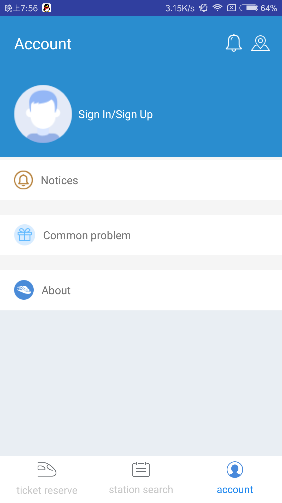
   
- Login, you can use username `fdse_microservices@163.com` && password `DefaultPassword`

 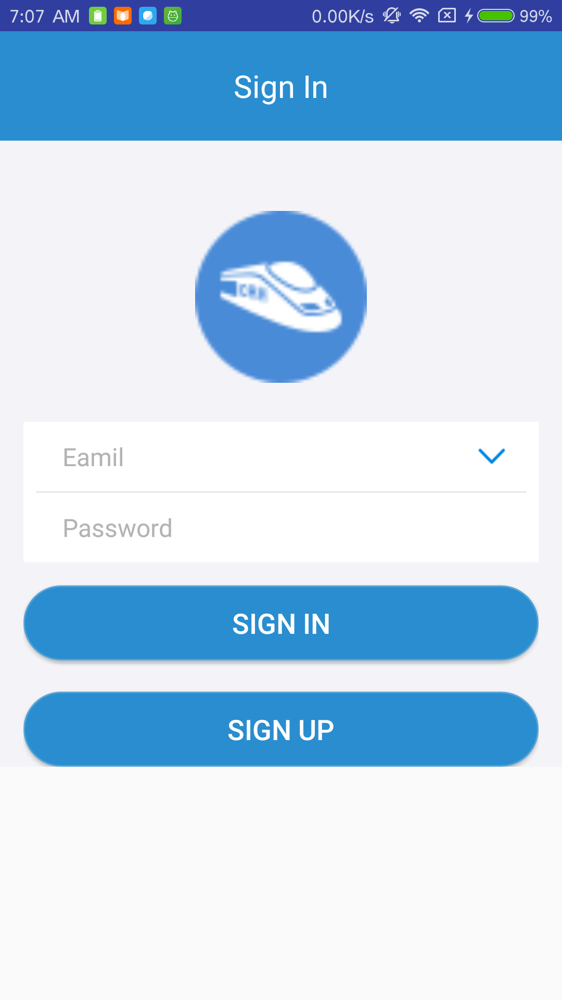
   
   
- After login, you will see the below  page

 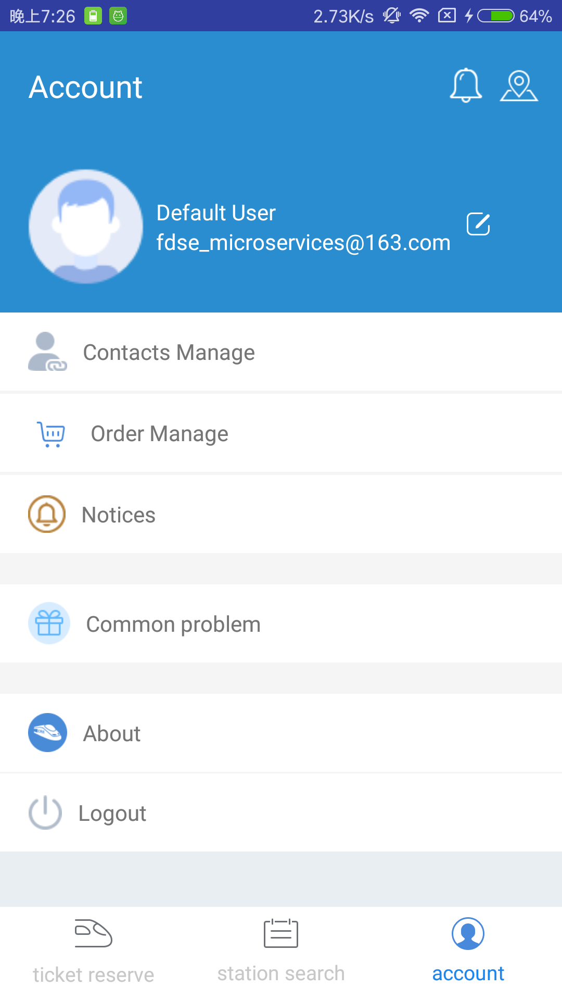
   

- Contacts List
   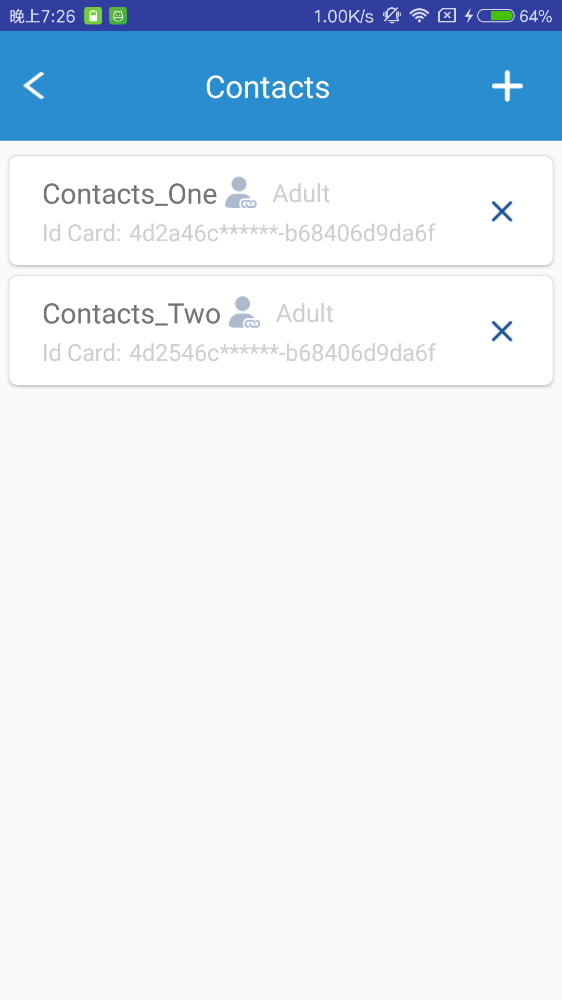

     
  
- orders  List
  
   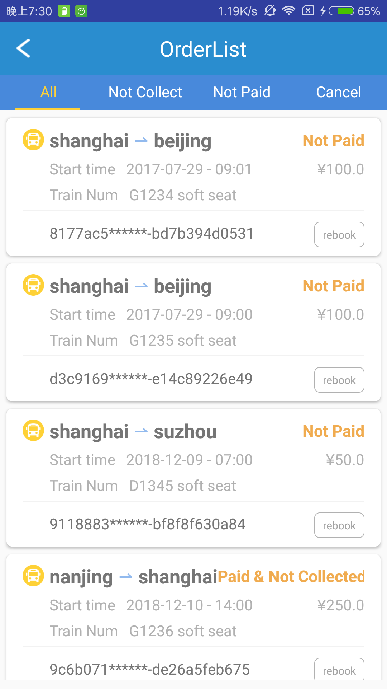

   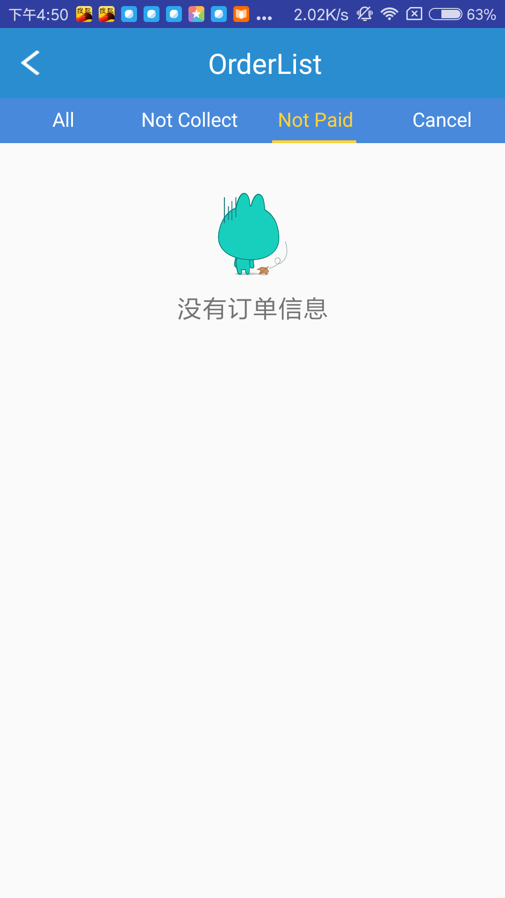
 
- Buy ticket

 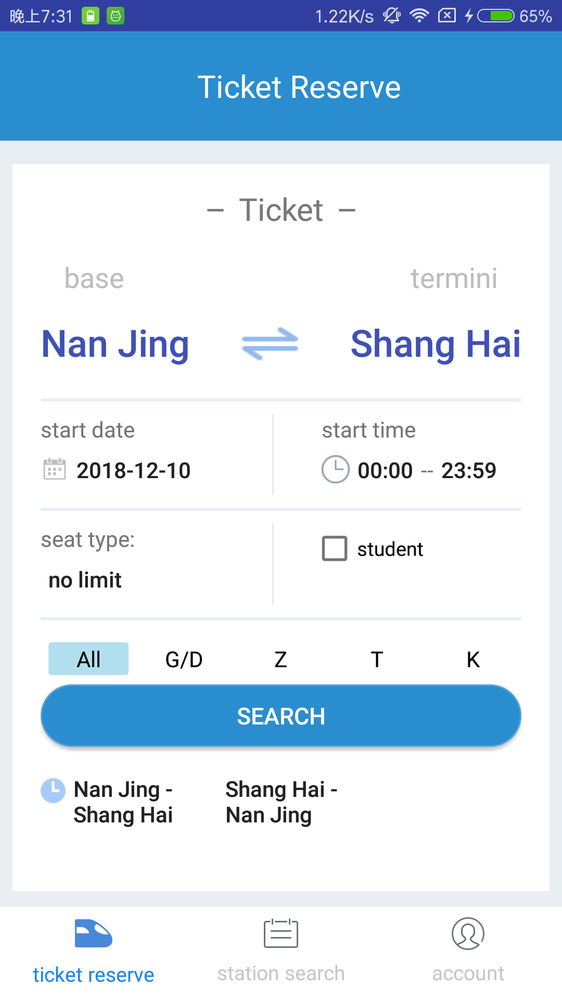

- Travel Path

 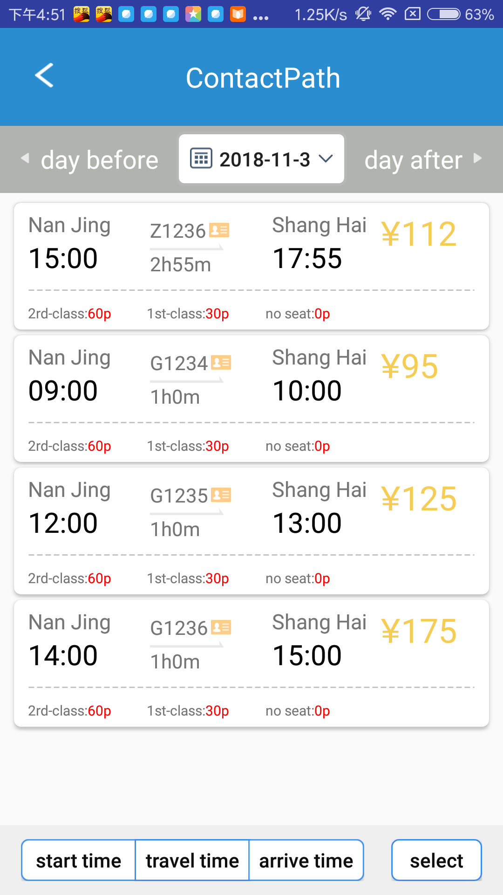
  
- Path Info
  
 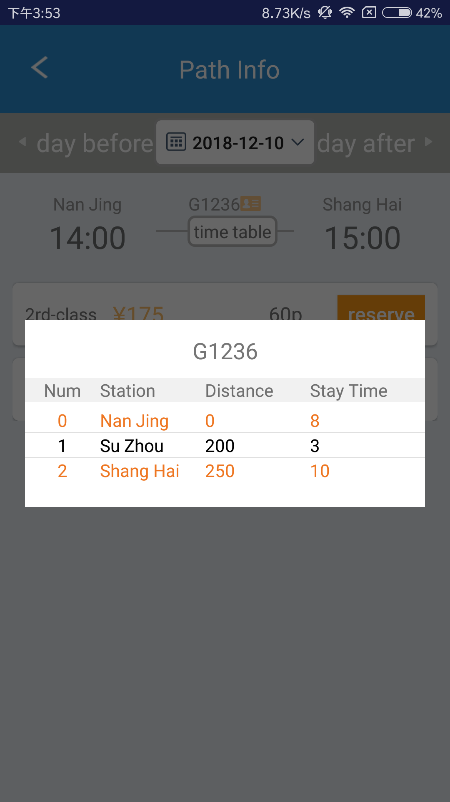

- Passenger Select

 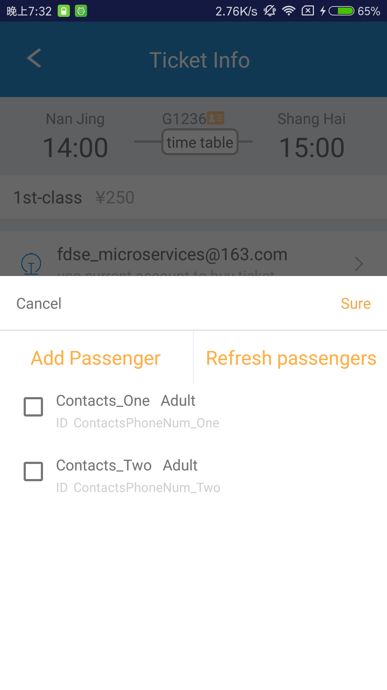

  
- Order Detail

 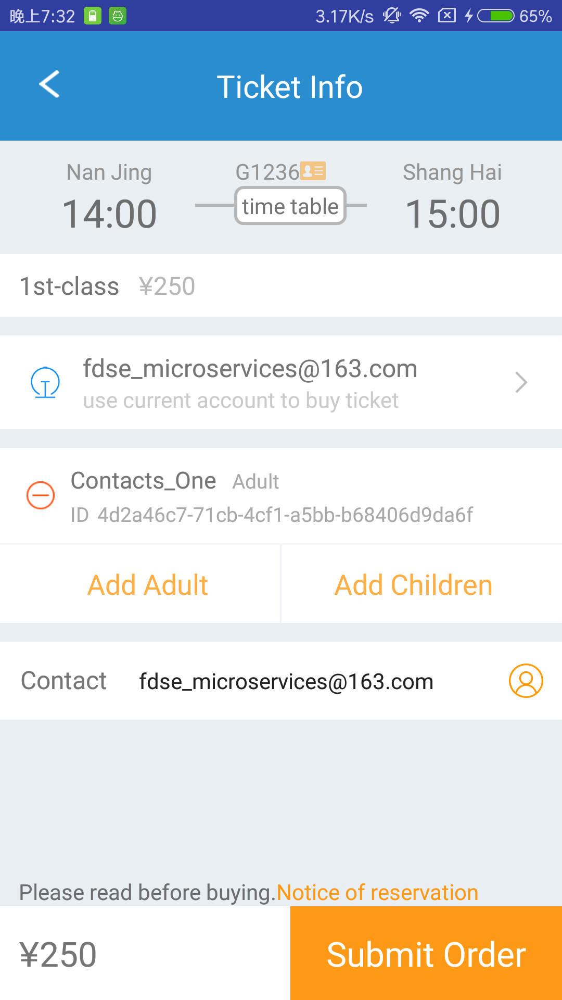

- City search
 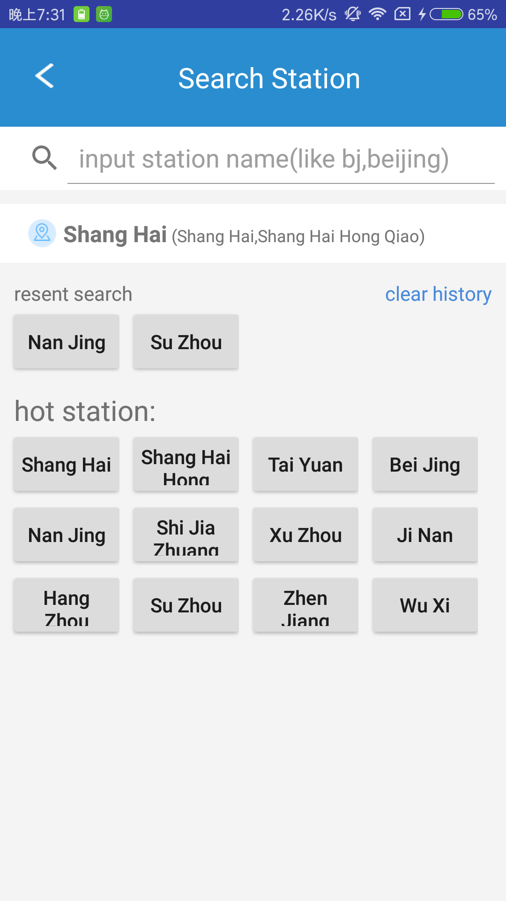